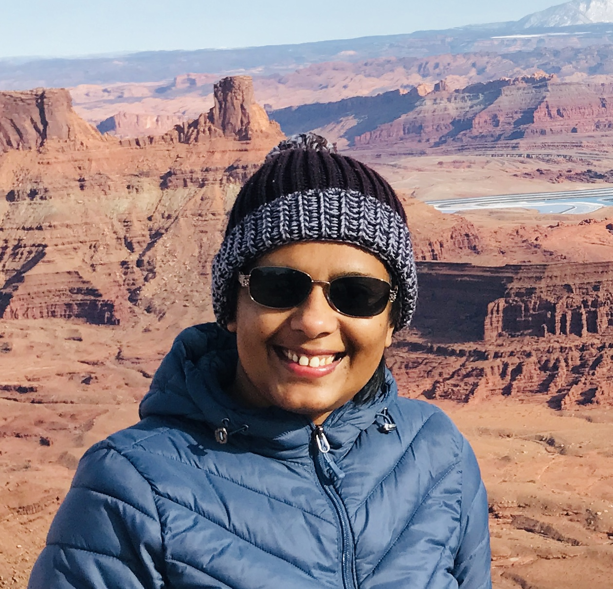

<section class="hero">
  
  

    <h1>Dr. Nayani Ilangakoon</h1>
    
Remote sensing scientist exploring ecosystem processes across spatial and temporal scales.

    
Find more about my collaborative work at <a href="https://cires.colorado.edu/people/nayani-ilangakoon">CIRES Earth Lab</a>.

    
I develop remote sensing approaches that combine lidar, spectral imagery, and field observations to understand ecosystem transformation, carbon trajectories, and resilience in fire-prone landscapes.

  

</section>

<section>
  <h2>Research Focus</h2>
  
My work centers on translating Earth observation data into actionable science for ecosystem stewardship. I specialize in:

  <ul>
    <li>Integrating remote sensing technologies (full waveform lidar, multispectral, hyperspectral, SAR, and UAS) to map ecosystem structure and function.</li>
    <li>Modeling wildfire-driven ecosystem transformation and postfire carbon recovery across western North America.</li>
    <li>Building open, transferable workflows and training resources that make remote sensing accessible to interdisciplinary teams.</li>
  </ul>
</section>

<section>
  <h2>Research Portfolio</h2>
  
Explore current projects and collaborations. Select a tab to learn more about each research effort.

  

    <button class="tab-link active" role="tab" aria-selected="true" aria-controls="tab-forest-observatory" id="tab-forest-observatory-button" data-tab="tab-forest-observatory">Open Forest Observatory</button>
    <button class="tab-link" role="tab" aria-selected="false" aria-controls="tab-ecosystem" id="tab-ecosystem-button" data-tab="tab-ecosystem">Ecosystem Transformation &amp; Carbon</button>
    <button class="tab-link" role="tab" aria-selected="false" aria-controls="tab-repeat-fires" id="tab-repeat-fires-button" data-tab="tab-repeat-fires">Repeat Fires &amp; Carbon Recovery</button>
    <button class="tab-link" role="tab" aria-selected="false" aria-controls="tab-fire-impacts" id="tab-fire-impacts-button" data-tab="tab-fire-impacts">Fire Impacts on Forests</button>
    <button class="tab-link" role="tab" aria-selected="false" aria-controls="tab-postfire-rockies" id="tab-postfire-rockies-button" data-tab="tab-postfire-rockies">Southern Rockies Postfire Carbon</button>
    <button class="tab-link" role="tab" aria-selected="false" aria-controls="tab-twensday" id="tab-twensday-button" data-tab="tab-twensday">Twensday-03</button>
  

  

    <h3>Open Forest Observatory</h3>
    
I co-lead the Open Forest Observatory initiative to develop forest inventories using individual tree species and structural attributes derived from unpiloted aerial vehicle (UAV) imagery. Our team tests the transferability of individual tree detection models across diverse vegetation conditions and designs training modules that empower scientists to use AI and machine learning for ecological applications.

  

  

    <h3>Ecosystem Transformation &amp; Carbon Consequences</h3>
    
This project models postfire ecosystem transformation trends and vulnerability in the North Central Climate Adaptation Science Center region. By coupling remote sensing time series analyses with known transformation locations and management interventions, we evaluate how alternative management strategies influence carbon storage trajectories.

  

  

    <h3>Repeat Fires &amp; Carbon Recovery</h3>
    
Using a century of fire records alongside GEDI, Sentinel-2, and MODIS observations, I quantify how repeat fire events shape carbon potential across western United States forests. The work highlights thresholds in resilience and guides prioritization of restoration investments.

  

  

    <h3>Fire Impacts on Forests</h3>
    
By combining new spaceborne lidar measurements with UAS-based canopy structure, composition, climate, and topographic data, I model postfire carbon recovery trajectories. The resulting datasets support scenario planning for land managers balancing carbon sequestration and biodiversity goals.

  

  

    <h3>Southern Rockies Postfire Carbon Potential</h3>
    
Field inventories and UAS campaigns across burned scars in the Southern Rockies inform structure-from-motion models that map conifer seedling regeneration and growth. The research identifies strategies that accelerate carbon gain and ecosystem resilience following fire.

  

  

    <h3>Twensday-03 Early Warning System</h3>
    
I lead the Twensday-03 collaboratory to design an early warning system that detects ecosystem transformation tipping points&mdash;including forest-to-grass, scrub, and shrubland transitions&mdash;in western U.S. forests. The effort leverages Earth observation data cubes and interdisciplinary expertise to anticipate change before it accelerates.

  

</section>

<section>
  <h2>Education</h2>
  <ul>
    <li><strong>Ph.D. in Geosciences</strong>, Boise State University, Boise, ID, USA (2014&ndash;2020)</li>
    <li><strong>M.S. in Geology</strong>, Bowling Green State University, Bowling Green, OH, USA (2012&ndash;2014)</li>
    <li><strong>B.S. in Geology</strong>, University of Peradeniya, Peradeniya, Sri Lanka (2005&ndash;2009)</li>
  </ul>
</section>

<section>
  <h2>Professional Experience</h2>
  <ul class="timeline">
    <li class="timeline__item">
      <h3>Research Scientist</h3>
      Earth Lab, Cooperative Institute for Research in Environmental Sciences, University of Colorado, Boulder &bull; June 2023&ndash;present
      
Designs workflows that integrate airborne, spaceborne, and field data to reveal how disturbances reshape carbon storage across landscapes.

    </li>
    <li class="timeline__item">
      <h3>Postdoctoral Research Associate</h3>
      Earth Lab, Cooperative Institute for Research in Environmental Sciences, University of Colorado, Boulder &bull; April 2020&ndash;May 2023
      
Advanced postfire recovery models, co-developed open-source analytics, and mentored students in remote sensing and data science.

    </li>
    <li class="timeline__item">
      <h3>Research Assistant</h3>
      Boise State University, Boise, ID, USA &bull; 2016&ndash;2020
      
Developed and maintained full waveform lidar processing tools, led field data collection, and analyzed airborne datasets to characterize vegetation structure, function, and diversity while mentoring graduate and undergraduate researchers.

    </li>
    <li class="timeline__item">
      <h3>Research Assistant</h3>
      Bowling Green State University, Bowling Green, OH, USA &bull; 2013&ndash;2014
      
Oversaw terrestrial laser scanning operations, delivered workshops on TLS data collection, and integrated TLS, field observations, and Landsat data to map forest functional traits.

    </li>
    <li class="timeline__item">
      <h3>Geologist</h3>
      Geological Survey and Mines Bureau, Sri Lanka &bull; 2011&ndash;2012
      
Conducted geological and geophysical resource mapping, prepared survey reports, and supported national assessments of mineral deposits.

    </li>
  </ul>
</section>

<section>
  <h2>Skills Snapshot</h2>
  

    

      <h3>Remote Sensing Expertise</h3>
      <ul>
        <li>Technologies: full waveform lidar, discrete return lidar, hyperspectral, multispectral, SAR, and structure-from-motion photogrammetry.</li>
        <li>Platforms: satellite, piloted airborne, unpiloted airborne systems (UAS), and terrestrial sensors.</li>
        <li>End-to-end project execution from data collection to product development.</li>
        <li>Domain knowledge spanning forest growth, plant functional traits, wildfires, drought, and carbon sequestration.</li>
      </ul>
    

    

      <h3>Geospatial Analytics</h3>
      <ul>
        <li>Spatial analytics, algorithm development, geospatial data management, and rigorous QA/QC.</li>
        <li>Remote sensing big data analytics using high-performance computing, AWS, Google Earth Engine, and Google Colab.</li>
      </ul>
    

    

      <h3>Programming</h3>
      <ul>
        <li>Python: Jupyter Notebook, PyCharm, Anaconda, and geospatial libraries including arcpy, GDAL, OGR, shapely, and geopandas.</li>
        <li>R: RStudio, R Notebook, and packages such as sf, terra, lidR, and raster.</li>
        <li>MATLAB: signal processing and custom workflows.</li>
      </ul>
    

    

      <h3>Software &amp; Collaboration</h3>
      <ul>
        <li>ENVI, Esri ArcGIS, QGIS, GDAL/OGR, Agisoft Metashape, and Terrasolid.</li>
        <li>Version control and collaboration tools including Git, MS Teams, Trello, Slack, and Google Docs.</li>
      </ul>
    

    

      <h3>Field &amp; Outreach</h3>
      <ul>
        <li>Operation of terrestrial laser scanners, UAS (trained pilot), spectroradiometers, LAI-2200, AccuPAR LP-80, and RTK GPS systems.</li>
        <li>Experienced in organizing workshops, presenting at conferences, technical writing, and teaching introductory remote sensing and geology.</li>
      </ul>
    

  

</section>

# Education
- Ph.D. in Geosciences, Boise State University, Boise, ID, USA (2014-2020)
- MS in Geology, Bowling Green State University, Bowling Green, OH, USA (2012-2014)
- BS in Geology, University of Peradeniya, Peradeniya, Sri Lanka (2005-2009)

# Positions

**Research Scientist**, June 2023 - present: Earth Lab, Cooperative Institute for Research in Environmental Sciences, University of Colorado, Boulder

**Postdoctoral Research Associate**, April 2020 – May 2023: Earth Lab, Cooperative Institute for Research in Environmental Sciences, University of Colorado, Boulder

**Research Assistant**, 2016- 2020: Boise State University, Boise, ID, USA
- Developed and maintained full waveform lidar processing tools. Collected field data (shrub inventory and spectroscopy) and analyzed airborne full waveform lidar big data to characterize semi-arid vegetation structure (height, cover, volume), function (biomass, plant functional types), and diversity (richness, evenness, and divergence). Mentored graduate and undergraduate students in Geosciences and Computer Science.
  
**Research Assistant**, 2013- 2014: Bowling Green State University, OH, USA
- Oversaw the terrestrial laser scanner (TLS) and held workshops for faculty and students about TLS handling and data collection. Integrated TLS, field observations and Landsat data to scale up mapping functional traits (leaf area index) of a forested ecosystem.
Geologist, 2011-2012: geological Survey and Mines Bureau, Sri Lanka
Conducted geological and geophysical mapping of earth resources (mineral sand, magnetite, coarse (river) sand, and Quartz. Prepared survey reports.

# Current projects
**Open Forest Observatory** – Develop Forest inventory using individual tree species and structural attributes from images collected from unpiloted aerial vehicles (UAVs). Test individual tree detection model transferability across site/vegetation conditions. Develop training modules to train the next generation of scientists for drone image analysis through AI and machine learning for ecological applications.  

**Ecosystem transformation and carbon consequences** - Model the postfire ecosystem transformation trends and vulnerability in the North Central CASC region and impact on carbon storage under various management scenarios using remote sensing time series analysis integrated with known locations of ecosystem transformations and management interventions.  

**Repeat fires on carbon recovery in forested systems in the western US**: Assess the impact of repeat fires (100 years of fire records) on carbon potential of forested ecoregions in the western US using GEDI, Sentinel-2, and MODIS.

**Fire Impacts on Forests** - Model post fire carbon recovery using new spaceborne lidar remote sensing (GEDI) and UAS based canopy structure and composition with climate, topography, and field observations.

**Postfire carbon potential and regeneration strategies in Southern Rockies**: Collects field inventory and UAS data across burned scars in the Southern Rockies and use structure from motion (SFM) technology and other statistical and modeling tools (R based) to map conifer seedlings and their spatial distribution and growth (carbon gain).

**Twensday-03**: Lead a collaboratory effort to develop an early warning system to identify ecosystem transformation (forest to grass, scrub and shrublands) tipping points in the western US forest systems using earth observation data cube

# Professional and academic skills
- Remote Sensing
	Technologies - lidar (full waveform and discrete return), hyperspectral, multispectral, SAR, and structure from motion photogrammetry
	Platforms – Satellite, piloted airborne and unpiloted airborne systems (UAS), and terrestrial sensor platforms
	End-to-end remote sensing project planning and execution from data collection to product development
	Domain knowledge - Forest growth, plant functional types and traits, wildfires, drought, and carbon sequestration
- GIS - Spatial analytics, algorithm development, geospatial data management, and data QA/QC
- High Performance Computing and Cloud Computing - Remote Sensing big data analytics using super computers, AWS, Google Earth Engine, and Google Colab
- Scientific Programing –
	Python – Jupyter Notebook, PyCharm, Anaconda and arcpy, GDAL, OGR, shapely, geopandas packages
	R – RStudio, R Notebook and R Markdown, and sf, terra, lidR, and raster packages
	MATLAB – Signal Processing Toolbox and customized signal processing workflows
- Remote Sensing and GIS software – ENVI, Esri ArcGIS suite of products, QGIS, GDAL/OGR, Agisoft Metashape, and Terrasolid
- Collaboration Software – version control systems (Git), MS Teams, Trello, Slack, and Google docs
- Field Data Collection – Hands on experience in operating Terrestrial Laser Scanners, Unmanned Aerial Systems (trained pilot), Spectroradiometer, LAI 2200 plant canopy analyzer, AccuPAR LP-80 Ceptometer, and RTK GPS systems
- Organizing and Presentation Skills - Organizing and conducting workshops and presenting at conferences
- Technical Writing - Writing and reviewing proposals, manuscripts, and blogs
- Teaching - Introductory Remote Sensing and introductory Geology

